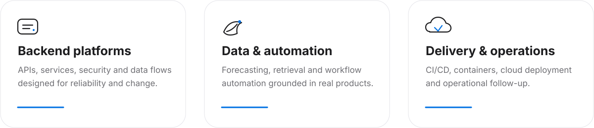
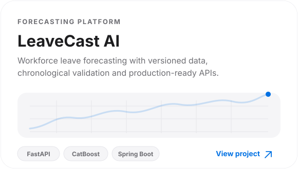
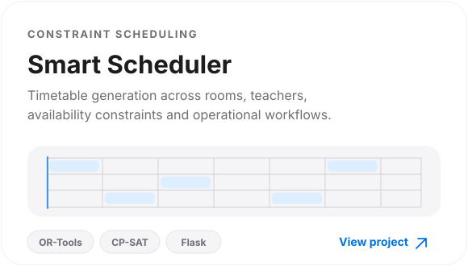

<!--
  Clean GitHub Profile — Abdellah Bouaamoud
  Direction: restrained product design, generous spacing, subtle motion.
-->

  

  <a href="https://abdellahdev.vercel.app/"><strong>Portfolio</strong></a>
  &nbsp;&nbsp;·&nbsp;&nbsp;
  <a href="https://www.linkedin.com/in/abdellah-bouaamoud-87596924a/"><strong>LinkedIn</strong></a>
  &nbsp;&nbsp;·&nbsp;&nbsp;
  <a href="mailto:bouaamoudabdellah@gmail.com"><strong>Email</strong></a>
  &nbsp;&nbsp;·&nbsp;&nbsp;
  <a href="https://github.com/AbdellahBM?tab=repositories"><strong>Repositories</strong></a>

 

## About

I design backend systems from the first data model to deployment and operational follow-up. My work spans **Java/Spring**, **Node.js/NestJS**, and **Python/FastAPI**, with a focus on reliable services, practical automation, and data-driven features that solve real product problems.

Most of my commercial and freelance work is private because it belongs to clients. The public repositories below are selected technical demonstrations—not the full scope of my professional experience.

 

  

 

## Selected public work

  
  

 

## Professional delivery

  

 

## Core toolkit

  <strong>Java · Spring Boot · Node.js · NestJS · Python · FastAPI · PostgreSQL · Redis · Docker · CI/CD · AWS · Azure</strong>

  Clear architecture &nbsp;·&nbsp; Secure APIs &nbsp;·&nbsp; Measured performance &nbsp;·&nbsp; Automated delivery &nbsp;·&nbsp; Observable systems

 

---

  <strong>Building reliable systems, quietly and well.</strong>
    
  <a href="mailto:bouaamoudabdellah@gmail.com">Start a conversation</a>

